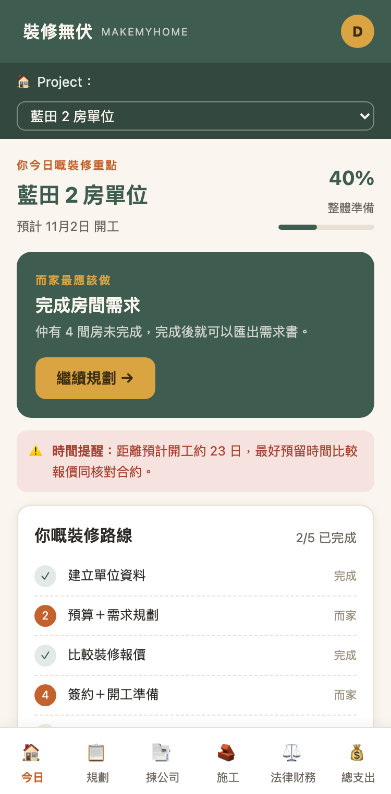
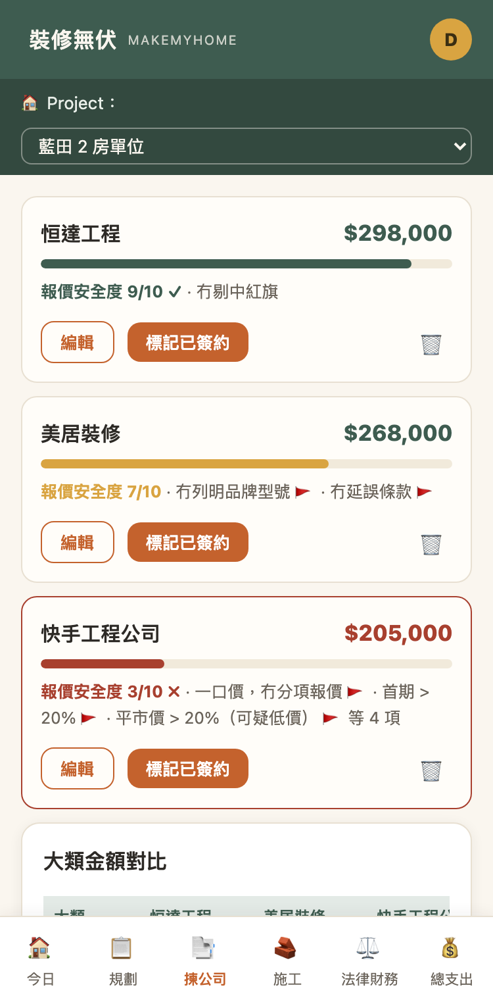
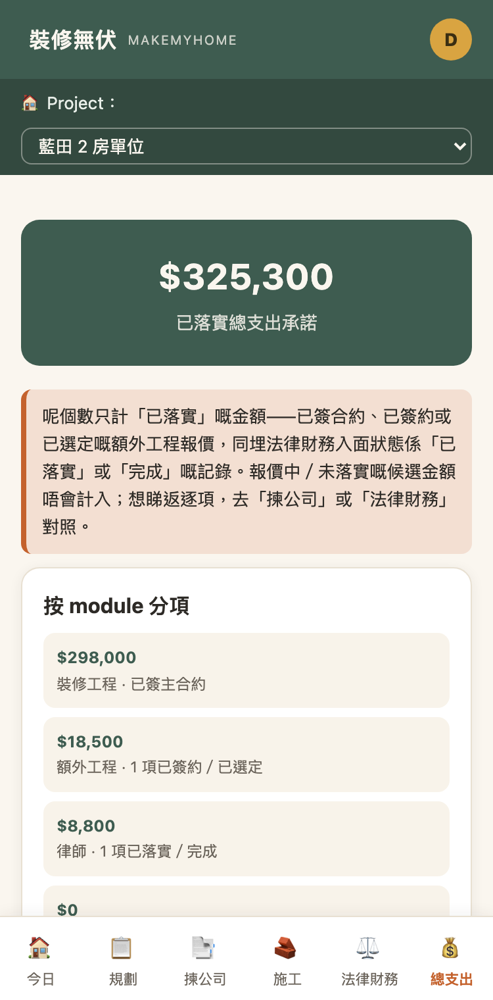

# 裝修無伏 · MakeMyHome

**A renovation companion for first-time home renovators in Hong Kong.**
Cantonese UI · live at **[make-my-home-xi.vercel.app](https://make-my-home-xi.vercel.app)**

I built this after my own first renovation. The hard part wasn't the building work. It was not knowing what to ask, what a fair quote looks like, and what to check before signing off each stage. MakeMyHome walks a first-timer through the whole journey: planning, choosing a contractor, building, and the legal and money side.

## Screenshots

<table>
  <tr>
    <td align="center"></td>
    <td align="center"></td>
    <td align="center"></td>
  </tr>
  <tr>
    <td align="center"><sub><b>Today</b> — what to do next, and where you are on the route</sub></td>
    <td align="center"><sub><b>Choosing a contractor</b> — quotes scored, red flags called out</sub></td>
    <td align="center"><sub><b>Total spend</b> — every committed cost in one view</sub></td>
  </tr>
</table>

<sub>Screenshots use demo data, not a real household's records.</sub>

## What it does

| Area | What the user gets |
|---|---|
| **Free tools** (no login) | Timeline and budget calculators, renovation journey guide, how to brief a designer, inspection checklists, common traps, jargon dictionary |
| **Planning** | Room-by-room requirements questionnaire (usage, furniture, storage, lighting, power points), exported as a brief to hand to designers |
| **Design & floor plans** | Per-room design reference gallery; upload a floor plan photo and measure on it (the first line drawn calibrates the scale) |
| **Choosing a contractor** | Side-by-side quote cards with category totals, line items, and a 10-point red-flag checklist |
| **Building** | Stage-by-stage inspection checklists with photo records and notes attached to each stage |
| **Legal & finance** | Lawyer and mortgage records, with automatic mortgage calculations (property value, down payment %, cash rebate %) |
| **Total spend** | One view of every committed cost across quotes, extra works and legal/finance |

Sign-in is Google only. Calculators and guides stay public; anything that saves data needs an account.

## How it's built

- **Front end:** single-page vanilla JavaScript, no framework or build step (`app.html`, `landing.html`, `js/`, `css/shared.css`)
- **Back end:** Supabase (Postgres, Auth with Google OAuth, Storage)
- **Hosting:** Vercel

```
landing.html     public landing page and calculators
app.html         signed-in app (hash-routed tabs)
js/supabase.js   client setup (publishable key only)
js/auth.js       Google sign-in and session guard
js/db.js         all database reads and writes, each with a timeout
js/photos.js     in-browser compression (≤300KB, max 1600px) and upload
supabase/migrations/   schema, row-level security, storage policies
```

## Decisions worth noting

- **Every user only sees their own data.** Each table has row-level security policies scoped to `auth.uid()`. Photos sit in a private bucket with one folder per user.
- **Scope was set before building.** A written build spec fixed the stack, the sign-in boundary and what stays out of v1 (AI quote parsing, share links, drag-and-drop power-point layouts). Each phase was checked against its acceptance criteria before the next began.
- **Building on what the data can actually support.** For the spending overview, an audit showed the schema couldn't tell paid from unpaid. Rather than invent a status field, v1 shows committed spend only.
- **Errors surface instead of silently hanging.** supabase-js serialises session refresh across browser tabs. With several tabs open, a stuck lock can make every request hang with no error. I traced that in production, then wrapped every database call in a 15-second timeout that shows a clear message.
- **Photos are compressed in the browser** before upload, to keep storage and mobile data use low.

## Quality checks

- Tested at 375px mobile width with no layout overflow and no console errors
- Lighthouse mobile on the landing page: Performance 100, Accessibility 93, Best Practices 100, SEO 100
- Real sign-in and create/read/update/delete for every module confirmed in production logs

## Roadmap

- Read-only share link for family or a designer
- AI-assisted quote parsing
- Installable app (PWA)

---

Built by [Stephanie Au](https://github.com/auzistephanie).
